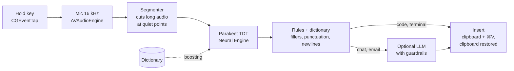

<p align="center">
  
</p>

<p align="center">
  <b>Local voice dictation for macOS, built for coding with AI agents.</b><br>
  Hold a key, speak, release: the text appears in whatever app you're typing in, already cleaned up.<br>
  Speech recognition runs on your Mac's Neural Engine. Your audio never leaves the computer.
</p>

<p align="center">
  <a href="https://github.com/Gigyo96/voce/releases/latest"></a>
  <a href="https://github.com/Gigyo96/voce/actions/workflows/ci.yml"></a>
  
  
  
  <a href="LICENSE"></a>
</p>

---

## Install

Paste this into Terminal:

```bash
curl -fsSL https://raw.githubusercontent.com/Gigyo96/voce/main/scripts/install.sh | bash
```

The script downloads the latest release, puts it in `/Applications` and opens it. Voce lives in the menu bar. The window that
opens walks you through three permissions (Microphone, Accessibility, Input Monitoring) and a one-time download of the speech
model (about 700 MB). After that, **hold right ⌘, speak, and release.**

You need an Apple Silicon Mac (M1 or later) with macOS 15 Sequoia or later.

<details>
<summary>Prefer to download it by hand?</summary>

1. Download `Voce.zip` from the [latest release](https://github.com/Gigyo96/voce/releases/latest) and move `Voce.app` to Applications.
2. Voce isn't notarized by Apple (that needs a paid developer account), so the first launch is blocked.
   Open **System Settings › Privacy & Security** and click **Open Anyway**, or run
   `xattr -dr com.apple.quarantine /Applications/Voce.app`.

</details>

## What it does

| | |
|---|---|
| **Fast and private** | NVIDIA Parakeet TDT runs on the Neural Engine through [FluidAudio](https://github.com/FluidInference/FluidAudio): about 60 ms for 5 s of speech on an M2. Works offline. |
| **Knows your jargon** | A personal dictionary (`Supabase`, `useEffect`, `kubectl`…) steers recognition and fixes words it keeps mishearing. Adding a correction takes two clicks from your last dictation. |
| **Clean output** | Removes filler words ("ehm", "uhm"), handles "a capo" / "nuovo paragrafo" and adapts to the app you're in. Terminals and IDEs get literal text; chat and email can be polished by an optional LLM. |
| **Edits selected text** | Select some text, hold the key with ⇧ and say what to do with it: "translate into English", "make it more formal". |
| **Any keyboard** | Right ⌘ by default. You can switch to ⌥, ⌃ or Fn, or record any key or combination: left or right modifiers, F1–F20, the 🎤 key, the Menu key on PC keyboards. Works with any layout. |
| **Hands-free** | Press the key and then Space to keep dictating without holding anything. Tap the key again to finish, or press Esc to cancel. |

<p align="center">
  
  
</p>

<p align="center">
  
  
</p>

> The interface and the voice commands are in Italian, Voce's first audience. The speech model also understands English
> and 23 other European languages, and handles English technical terms in Italian speech.

## Shortcuts

| Gesture | Effect |
|---|---|
| Hold **right ⌘** | Push-to-talk: release to insert the text |
| Right ⌘ + **Space** | Hands-free: tap the key to finish, **Esc** to cancel |
| Right ⌘ + **⇧** on selected text | Command mode: speak an instruction that rewrites the selection |
| **⌃⌥V** | Paste the last dictation again |
| "invia" at the end | Presses Return (opt-in, terminals and code editors only) |

If you press another key while holding the trigger (⌘C, ⌘Tab…), Voce assumes it was a shortcut and cancels the dictation.

## How it works



- **Low latency.** Long dictations are transcribed in segments while you're still speaking, and the model is warmed up as soon
  as you press the key. On release, only the last few seconds are left to process.
- **Per-app profiles.** The profile depends on the frontmost app: `agentIDE` (Cursor, VS Code, Windsurf, Zed), `agentTerminal`
  (Terminal, iTerm2, Ghostty, Warp), `chat`, `email` and `plain`. Terminals get ⇧↩ for newlines, so agent CLIs don't
  submit early.
- **LLM guardrails.** If the model's output is too short or too long, starts with a preamble ("Sure, here's…") or keeps less
  than half of your words, Voce inserts the rule-based text instead. Only text is ever sent to the LLM, never audio.
- **Clipboard respected.** Voce saves every pasteboard type before pasting and restores it afterwards. Its own text is marked
  as transient, so clipboard managers ignore it.

<details>
<summary><b>AI services (optional)</b></summary>

Any OpenAI-compatible endpoint works. You can set it up in the **Funzioni AI** page, with presets for LM Studio and Ollama
(running on your Mac), Groq, Cerebras, Google Gemini, Anthropic Claude, OpenAI and OpenRouter. API keys are stored in the
macOS Keychain, one per service. Commands on selected text can use a separate, stronger model.

</details>

<details>
<summary><b>Personal dictionary</b></summary>

The dictionary is edited in the app, or by hand in `~/.voce/dictionary.json` (it reloads on every change):

```json
{
  "terms":   ["Claude Code", "Supabase", "useEffect", "kubectl", "PostgreSQL", "Next.js"],
  "replace": { "cube cuttle": "kubectl", "postgres q l": "PostgreSQL" }
}
```

`terms` boost recognition, and spoken forms like "next js" are added automatically. `replace` maps phonetic variants to the
spelling you want.

</details>

<details>
<summary><b>Files and privacy</b></summary>

| Path | Contents |
|---|---|
| `~/.voce/dictionary.json` | Your dictionary |
| `~/.voce/log.jsonl` | Local history: app, raw and final text, timings. Never uploaded |
| `~/Library/Application Support/FluidAudio/Models` | Speech models (downloaded once) |

To uninstall, delete `Voce.app` and the files above, then run `tccutil reset All it.dimarcantonio.voce` to clear the permissions.

</details>

## Build from source

You need Xcode 26 (Swift 6.2).

```bash
git clone https://github.com/Gigyo96/voce.git && cd voce
scripts/build.sh --install     # builds build/Voce.app, copies it to ~/Applications and launches it
swift test                     # unit tests: rules, dictionary, guardrails, segmenter, hotkeys
```

Optional: run `scripts/setup-signing.sh` once to create a stable local signing identity. Without it, every rebuild counts as a
new app for macOS, and you have to grant the permissions again.

Developer tools:

- `Voce transcribe file.wav` runs the same pipeline from the command line.
- `tools/eval.py` measures WER, term accuracy and latency on your own recordings.
- `Voce snapshot <dir>` renders the UI to PNG.

To publish a release, push a tag: `git tag v1.1.0 && git push --tags`. CI builds the app and attaches `Voce.zip`.

| Path | |
|---|---|
| `Voce/Hotkey.swift` | Global trigger (CGEventTap + IOHID for Fn), shortcut recorder, keyboard/layout handling |
| `Voce/Recorder.swift` · `Transcriber.swift` | Mic capture, Parakeet via FluidAudio, vocabulary boosting |
| `Voce/PostProcess.swift` | Rules, dictionary, app profiles, LLM guardrails |
| `Voce/Paster.swift` | Insertion and clipboard restore |
| `Voce/Controller.swift` | Pipeline, preferences, history, CLI |
| `Voce/HUD.swift` · `Pages/` | Floating HUD and settings window (SwiftUI) |

The design rationale is in [SOLUTION_DESIGN.md](SOLUTION_DESIGN.md) (Italian).

## Roadmap

- **Meeting mode**: record microphone and system audio, separate the speakers (diarization) and extract decisions, open
  questions and action items.
- English interface.
- Signed and notarized builds.

## Credits

- [FluidAudio](https://github.com/FluidInference/FluidAudio) (Apache 2.0): Core ML speech models for Apple platforms.
- [NVIDIA Parakeet TDT](https://huggingface.co/nvidia/parakeet-tdt-0.6b-v3) (CC-BY-4.0): the speech recognition model.

Voce is released under the [MIT license](LICENSE).
