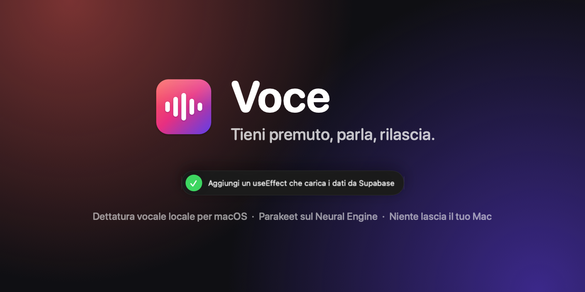
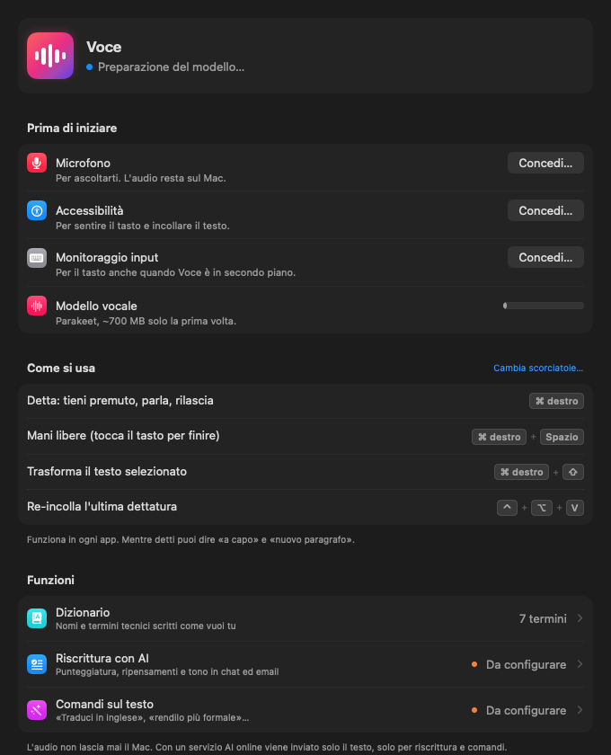
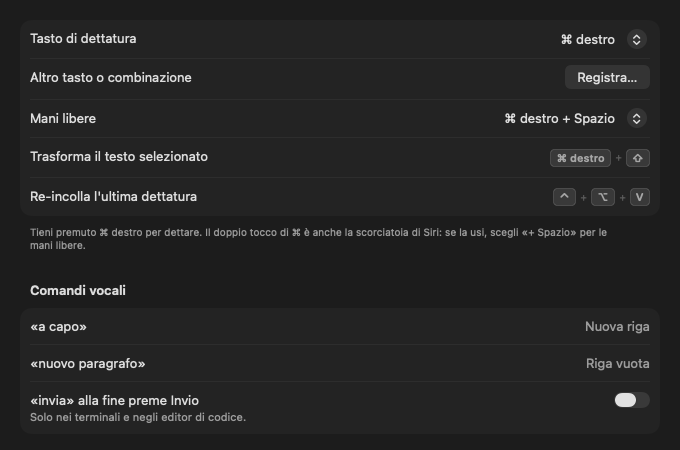
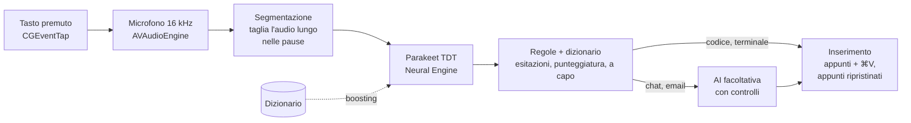

<p align="center">
  
</p>

<p align="center">
  <b>Dettatura vocale per macOS che funziona tutta sul tuo Mac, pensata per scrivere ai colleghi e agli agenti AI.</b><br>
  Tieni premuto un tasto, parla, rilascia: il testo compare nell'app in cui stai scrivendo, già pulito.<br>
  Il riconoscimento vocale gira sul Neural Engine del Mac. L'audio non lascia mai il computer.
</p>

<p align="center">
  <a href="https://github.com/Gigyo96/voce/releases/latest"></a>
  <a href="https://github.com/Gigyo96/voce/actions/workflows/ci.yml"></a>
  
  
  
  <a href="LICENSE"></a>
</p>

---

## Perché Voce

Si parla molto più in fretta di quanto si scriva. Con gli agenti AI (Claude Code, Cursor, Copilot) gran parte del
lavoro è descrivere bene cosa vuoi, e scriverlo è proprio la parte lenta.

Molti strumenti di dettatura mandano l'audio su un server, sbagliano i termini tecnici ("use effect" al posto
di `useEffect`) oppure fanno riscrivere il testo a un'AI che a volte *risponde* al tuo prompt invece di trascriverlo.
Voce nasce per evitare questi tre problemi:

- **Privata.** Il riconoscimento vocale avviene sul Mac e funziona anche offline.
- **Veloce.** Circa 60 millisecondi per 5 secondi di parlato su un Mac con chip M2.
- **Fedele.** Nei terminali e negli editor di codice incolla esattamente quello che hai detto, con i nomi tecnici
  scritti come li scrivi tu.

## Installazione

Apri il Terminale e incolla:

```bash
curl -fsSL https://raw.githubusercontent.com/Gigyo96/voce/main/scripts/install.sh | bash
```

Lo script scarica l'ultima versione, la copia in Applicazioni e la apre. Voce vive nella barra dei menu, in alto a
destra. Al primo avvio una finestra ti guida a concedere tre permessi (Microfono, Accessibilità e Monitoraggio input)
e scarica una sola volta il modello vocale (circa 700 MB). Poi **tieni premuto ⌘ destro, parla e rilascia.**

Serve un Mac con Apple Silicon (M1 o successivo) e macOS 15 Sequoia o successivo.

<details>
<summary>Preferisci scaricarla a mano?</summary>

1. Scarica `Voce.zip` dall'[ultima versione](https://github.com/Gigyo96/voce/releases/latest) e sposta `Voce.app`
   in Applicazioni.
2. Voce non è notarizzata da Apple (servirebbe un account sviluppatore a pagamento), quindi al primo avvio macOS la
   blocca. Apri **Impostazioni di Sistema › Privacy e sicurezza** e scegli **Apri comunque**, oppure esegui
   `xattr -dr com.apple.quarantine /Applications/Voce.app`.

</details>

<details>
<summary>Perché servono questi permessi?</summary>

| Permesso | A cosa serve |
|---|---|
| Microfono | Ascoltarti mentre tieni premuto il tasto. L'audio resta sul Mac. |
| Accessibilità | Incollare il testo nell'app in cui stai scrivendo. |
| Monitoraggio input | Accorgersi del tasto di dettatura anche quando Voce è in secondo piano. |

</details>

## Come si usa

| Gesto | Cosa succede |
|---|---|
| Tieni premuto **⌘ destro** | Detti finché tieni premuto. Al rilascio il testo viene incollato. |
| **⌘ destro + Spazio** | Mani libere: detti senza tenere premuto niente. Ripremi il tasto per finire, **Esc** per annullare. |
| **⌘ destro + ⇧** su un testo selezionato | Comando: di' cosa farne ("traduci in inglese") e il testo viene riscritto. |
| **⌃⌥V** | Incolla di nuovo l'ultima dettatura. |
| Di' **"a capo"** o **"nuovo paragrafo"** | Va a capo, oppure lascia una riga vuota. |
| Di' **"invia"** alla fine | Preme Invio (da attivare, solo nei terminali e negli editor di codice). |

Se mentre tieni premuto il tasto ne premi un altro (⌘C, ⌘Tab…), Voce capisce che stavi usando una scorciatoia e
annulla la dettatura. Il tasto si può cambiare: ⌥ o ⌃ destro, Fn, F1–F20, il tasto 🎤, il tasto Menu delle tastiere
PC o qualsiasi combinazione.

## Cosa sa fare

| | |
|---|---|
| **Veloce e privata** | Il modello NVIDIA Parakeet gira sul Neural Engine (il chip per l'AI dei Mac Apple Silicon) grazie a [FluidAudio](https://github.com/FluidInference/FluidAudio). Funziona offline. |
| **Conosce il tuo gergo** | Un dizionario personale (`Supabase`, `useEffect`, `kubectl`…) guida il riconoscimento e corregge le parole che sbaglia spesso. Una correzione si aggiunge in due clic dall'ultima dettatura. |
| **Testo pulito** | Toglie le esitazioni ("ehm", "uhm") e si adatta all'app: nei terminali e negli editor incolla il testo letterale, in chat e nelle email può farlo rifinire da un'AI (facoltativa). |
| **Trasforma il testo selezionato** | Selezioni un testo, tieni premuto il tasto con ⇧ e dici cosa farne: "traduci in inglese", "rendilo più formale". |
| **Ogni tastiera** | Qualsiasi tasto o combinazione, su qualsiasi tastiera e layout (italiano, US, Dvorak…). |
| **Cronologia** | Tutte le dettature, cercabili, con l'app in cui le hai fatte. Resta sul Mac. |

<p align="center">
  
  
</p>

<p align="center">
  
  
</p>

> L'interfaccia e i comandi vocali sono in italiano. Il modello riconosce anche l'inglese e le altre lingue europee
> supportate da Parakeet (25 in tutto), e capisce i termini tecnici inglesi dentro una frase in italiano.

## Privacy

- **L'audio non lascia mai il Mac.** Il riconoscimento vocale è locale e funziona senza internet.
- **L'AI è facoltativa.** Se attivi la rifinitura o i comandi con un servizio online (Groq, OpenAI…), a quel servizio
  arriva solo il **testo**, mai l'audio. Con LM Studio o Ollama anche il testo resta sul Mac.
- **Le chiavi API** sono salvate nel Portachiavi di macOS.
- **La cronologia** è un file sul tuo Mac (`~/.voce/log.jsonl`) e non viene caricata da nessuna parte.
- **Gli appunti vengono rispettati.** Voce incolla passando dagli appunti, ma prima li salva e poi li ripristina. Il suo
  testo è marcato come temporaneo, così i gestori di appunti lo ignorano.

## Come funziona



- **Latenza bassa.** Le dettature lunghe vengono trascritte a pezzi mentre parli ancora, e il modello si "scalda"
  appena premi il tasto. Al rilascio restano da elaborare solo gli ultimi secondi.
- **Profili per app.** Il trattamento del testo dipende dall'app in primo piano: editor di codice (Cursor, VS Code,
  Windsurf, Zed), terminali (Terminale, iTerm2, Ghostty, Warp), chat, email e tutto il resto. Nei terminali gli a capo
  diventano ⇧↩, così gli agenti da riga di comando non inviano il messaggio a metà.
- **Controlli sull'AI.** Se il testo rifinito è troppo corto o troppo lungo, comincia con un preambolo ("Certo, ecco…")
  o conserva meno della metà delle tue parole, Voce lo scarta e incolla il testo pulito dalle sole regole.

<details>
<summary><b>Servizi AI (facoltativi)</b></summary>

Va bene qualsiasi servizio compatibile con l'API di OpenAI. Si configura nella pagina **Funzioni AI**, che ha impostazioni
già pronte per LM Studio e Ollama (sul Mac, gratis), Groq, Cerebras, Google Gemini, Anthropic Claude, OpenAI e OpenRouter.
Per ogni servizio la chiave API va nel Portachiavi. I comandi sul testo selezionato possono usare un modello diverso e
più capace.

</details>

<details>
<summary><b>Dizionario personale</b></summary>

Il dizionario si modifica dall'app, oppure a mano in `~/.voce/dictionary.json` (Voce lo ricarica a ogni modifica):

```json
{
  "terms":   ["Claude Code", "Supabase", "useEffect", "kubectl", "PostgreSQL", "Next.js"],
  "replace": { "cube cuttle": "kubectl", "postgres q l": "PostgreSQL" }
}
```

- `terms`: le parole da riconoscere e da scrivere esattamente così. Le forme parlate ("next js", "use effect") vengono
  aggiunte in automatico.
- `replace`: come Voce ha trascritto male una parola → come va scritta.

</details>

<details>
<summary><b>File e disinstallazione</b></summary>

| Percorso | Contenuto |
|---|---|
| `~/.voce/dictionary.json` | Il tuo dizionario |
| `~/.voce/log.jsonl` | La cronologia: app, testo grezzo e finale, tempi. Non viene mai caricata |
| `~/voce-dataset/` | Registrazioni salvate, solo se le attivi (servono a misurare la precisione) |
| `~/Library/Application Support/FluidAudio/Models` | I modelli vocali, scaricati una volta |

Per disinstallare elimina `Voce.app` e i file qui sopra, poi esegui `tccutil reset All it.dimarcantonio.voce` per
togliere i permessi.

</details>

## Per sviluppatori

### Compilare dal codice sorgente

Serve Xcode 26 (Swift 6.2). L'unica dipendenza è [FluidAudio](https://github.com/FluidInference/FluidAudio).

```bash
git clone https://github.com/Gigyo96/voce.git && cd voce
scripts/build.sh --install     # compila build/Voce.app, la copia in ~/Applications e la avvia
swift test                     # test: regole, dizionario, controlli sull'AI, segmentazione, tasti, preferenze
```

Consiglio: esegui una volta `scripts/setup-signing.sh` per creare un'identità di firma locale e stabile. Senza, macOS
considera ogni build un'app nuova e i permessi vanno concessi di nuovo.

Strumenti:

- `Voce transcribe file.wav` esegue la stessa pipeline da riga di comando.
- `tools/eval.py` misura WER (tasso di errore sulle parole), precisione sui termini e latenza sulle tue registrazioni.
- `Voce snapshot <cartella>` salva l'interfaccia in PNG (le immagini di questo README vengono da lì).
- Diagnostica: `/usr/bin/log show --last 10m --predicate 'subsystem == "it.dimarcantonio.voce"'`.

Per pubblicare una versione basta un tag: `git tag v1.1.0 && git push --tags`. La CI compila l'app e allega `Voce.zip`
alla release, che è il file scaricato dallo script di installazione.

### Struttura del codice

| Cartella | Cosa contiene |
|---|---|
| `Voce/App/` | Avvio, `Controller` (il flusso di una dettatura), stato, permessi, CLI, diagnostica |
| `Voce/Input/` | Tasto globale (`CGEventTap` + IOHID per Fn), tastiere e layout, inserimento del testo |
| `Voce/Audio/` | Microfono, Parakeet via FluidAudio, boosting del dizionario, segmentazione dell'audio lungo |
| `Voce/Text/` | Profili per app, regole, dizionario personale, pipeline di post-processing |
| `Voce/AI/` | Client compatibile OpenAI, provider, prompt, controlli sull'output, stato dei servizi |
| `Voce/Storage/` | Preferenze tipizzate, Portachiavi, cronologia, percorsi dei file |
| `Voce/UI/` | HUD, finestra principale, componenti condivisi, una pagina per file in `Pages/` |
| `Tests/` | Test con Swift Testing, divisi per area |

Il flusso di una dettatura si legge dall'alto in basso in [`Voce/App/Controller.swift`](Voce/App/Controller.swift).
Le scelte di progetto, con la ricerca che le ha motivate, sono in [docs/SOLUTION_DESIGN.md](docs/SOLUTION_DESIGN.md):
i riferimenti `§` nei commenti rimandano alle sue sezioni.

Per aggiungere qualcosa:

- **una preferenza**: una riga in `Voce/Storage/Prefs.swift`, poi `@AppStorage(Prefs.nome)` nella pagina;
- **una pagina**: un caso in `Navigation.Page` (`Voce/UI/MainWindow.swift`) e la sua vista in `Voce/UI/Pages/`;
- **un'app con un profilo dedicato**: il suo bundle ID in `Profile.from(bundleID:)` (`Voce/Text/Profile.swift`);
- **un provider AI**: un caso in `LLMProvider` (`Voce/AI/LLMProvider.swift`).

Issue e pull request sono benvenute.

## Prossimi passi

- **Modalità riunione**: registrare microfono e audio di sistema, separare chi parla e ricavare decisioni, domande
  aperte e cose da fare.
- Interfaccia in inglese.
- Build firmate e notarizzate da Apple.

## Crediti

- [FluidAudio](https://github.com/FluidInference/FluidAudio) (Apache 2.0): modelli vocali Core ML per le piattaforme Apple.
- [NVIDIA Parakeet TDT](https://huggingface.co/nvidia/parakeet-tdt-0.6b-v3) (CC-BY-4.0): il modello di riconoscimento vocale.

Voce è distribuita con [licenza MIT](LICENSE).
